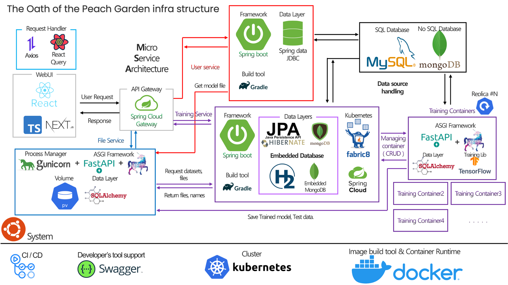

# Sketch-Brain Worker

 

- KU 도원결의 팀 졸업프로젝트의 실제 학습을 담당하고 있는 Training Container(Worker) 입니다.
- Sketch-brain Worker M1
- 개발 기한 2022/10~2022/11 1month

## Design

- Kubernetes를 기반으로 MSA를 모방하여, **Service**를 분해하는 전략을 선택하였습니다.
- Service Discovery 는 Kubernetes 의 Service로 사용하고, 따로 Eureka Client 를 사용하지 않았습니다.
- Dockerfile 을 통해 Image 로 구성하여 사용.

## Training Library

- Tensorflow 2 의 Sequential layer 를 이용하여 학습을 진행합니다.

## env

- Python 3.8.5
